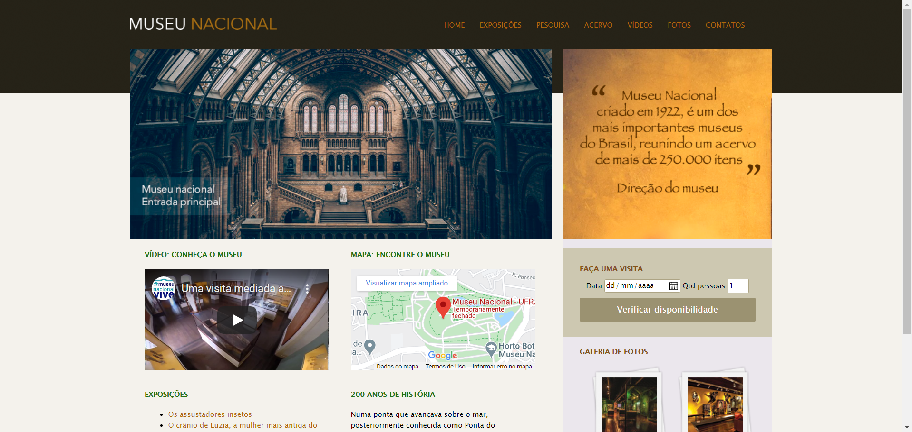

## 🏛  Museu Nacional

Um site simples para um museu. <strong>Criado com novas tags de estruturação HTML5.</strong>

Projeto do curso do Jamilton Damasceno feito pra colocar o HTML e CSS em dia. 

<h5>Feito com alguns novos recursos especiais de HTML e CSS.</h5>

	

<h6>Feito com ♥ por Robson!</h6>
---------------------------
